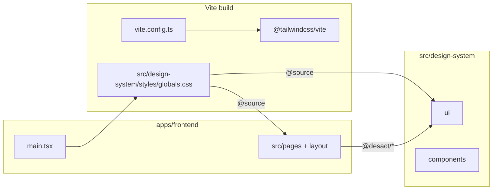

# Integrate the DESACT design system **inside** `@haber/frontend`

## Branch and workflow

- **Integration branch:** `frontend` (create from `main`, do all design-system work there).
- **Merge:** Open a PR from `frontend` into `main` when build, lint, and smoke checks pass.
- **Reference upstream (read-only):** `c:\workspace\galamine\Desact\DESACT` — the portable “extract” described in that folder’s `README.md`. Use it to **seed** files; Haber does **not** depend on that path at build time.

This replaces the earlier approach of keeping a **repo-root** `DESACT/` tree and long relative imports across the monorepo.

## What to copy (design system only)

From the reference `Desact/DESACT`, copy **only** the portable layout from the README—not an entire unrelated app:

| Source (reference) | Purpose |
| ------------------ | ------- |
| `styles/globals.css` | Tokens + `@import "tailwindcss"` + typography plugin hooks + base overrides |
| `styles/typography.css` | Prose variables (if globals imports it, keep the chain) |
| `styles/index.css` | **Optional:** only if you choose README Option B (prebuilt bundle). Do not combine A + B. |
| `lib/utils.ts` | `cn()` |
| `constants/*`, `hooks/*` | Shared by `ui/` and composites |
| `ui/*.tsx` | Radix + CVA primitives |
| `components/*` | Composites you actually use (e.g. `MainSidebar`, `PageHeader`) |

**Do not** mirror whole repositories or non-design-system app code. Trim optional `ui/*.tsx` files if you omit their npm deps (per README).

**Target in Haber:**

```text
apps/frontend/src/design-system/
  README.md              ← short “copied from Desact/DESACT + sync procedure”
  styles/
  lib/
  hooks/
  constants/
  ui/
  components/
```

After copy, fix any **internal** relative imports if the reference used different folder names; prefer stable public imports from the app: `@desact/ui/button`, etc.

## Current gap (unchanged intent, new paths)

| Area | Today (`apps/frontend`) | After integration |
| ---- | ----------------------- | ----------------- |
| Tailwind | v3 + `tailwind.config.ts` + PostCSS | v4 + `@tailwindcss/vite` (CSS-first config in `globals.css`) |
| Tokens | HSL vars in `src/index.css` | Brown palette + shadcn-compat tokens from `design-system/styles/globals.css` |
| UI | Hand-rolled `PageShell`; limited `components/ui` | Full primitives under `src/design-system/ui/` + optional composites |

Semantic classes like `bg-background` / `text-foreground` keep working if tokens define `--background` / `--foreground`. The **build pipeline** changes (v4 + Vite plugin), not only the CSS file swap.

## Recommended integration shape (Option A — Tailwind v4 in app)

1. **Tailwind v4 + Vite plugin**  
   - Add `tailwindcss` v4, `@tailwindcss/vite`, and `@tailwindcss/typography` to `apps/frontend/package.json`.  
   - Update `apps/frontend/vite.config.ts`: `import tailwindcss from '@tailwindcss/vite'` and add `tailwindcss()` next to `@vitejs/plugin-react`.  
   - **Remove** Tailwind from the PostCSS pipeline for this app unless another plugin still needs PostCSS.  
   - **Retire** `apps/frontend/tailwind.config.ts` and v3-only plugins such as `tailwindcss-animate` unless you add a v4-compatible replacement for classes used by copied components (`animate-in`, `accordion-down`, etc.)—treat as the main technical checkpoint.

2. **Single CSS entry**  
   - In `apps/frontend/src/main.tsx`, import the design-system stylesheet, e.g. `import '@/design-system/styles/globals.css'` (or a path alias you standardize on).  
   - **Do not** combine Option A (`globals.css` with `@import "tailwindcss"`) with Option B (`styles/index.css` prebuilt bundle) in the same app.

3. **`@source` for Tailwind scan**  
   Add `@source` directives in `globals.css` (paths are **relative to that CSS file**), for example from `apps/frontend/src/design-system/styles/globals.css`:

   - `../**/*.{ts,tsx}` — all TS/TSX under `design-system/`  
   - `../../**/*.{ts,tsx}` — rest of `apps/frontend/src/` (pages, shell, hooks)

   Adjust if you relocate `globals.css`; keep two globs so **app code + design-system** both generate utilities.

4. **Dependencies**  
   Align with the reference README: Radix packages, `class-variance-authority`, `clsx`, `tailwind-merge`, `lucide-react`, then add optional packages only for `ui` files you ship (`sonner`, `recharts`, `vaul`, …).

5. **TypeScript + Vite aliases**  
   - `tsconfig.app.json`: `"@desact/*": ["./src/design-system/*"]` (paths relative to `apps/frontend`).  
   - `vite.config.ts`: `resolve.alias` — `@desact` → `path.resolve(__dirname, 'src/design-system')` (or equivalent).  
   - Verify `pnpm exec tsc -b` / `pnpm build:frontend` from repo root.

6. **`cn()` single source**  
   Keep `apps/frontend/src/lib/utils.ts` as a thin re-export from `@desact/lib/utils` so existing `@/lib/utils` imports stay valid.

7. **Lint/format**  
   Copied TSX may use formatting that differs from Biome defaults. Either add a `biome.json` override for `apps/frontend/src/design-system/**` or run a one-time format—avoid noisy CI drift.

8. **Wire the app shell**  
   Refactor `PageShell.tsx` to use `@desact/ui/button`, `@desact/ui/separator`, etc.; optionally adopt `MainSidebar` / `PageHeader`. Add `<Toaster />` from `@desact/ui/sonner` in `App.tsx` if you standardize on Sonner.

9. **README / scripts**  
   If the reference README mentions `scripts/normalize-desact-ui-imports.mjs`, either add that script under `apps/frontend` or document manual import rules—don’t leave a broken doc pointer.



## Reference vs Haber (mental model)

| Location | Role |
| -------- | ---- |
| `c:\workspace\galamine\Desact\DESACT` | **Upstream reference** — copy updates from here when refreshing the design system. |
| `apps/frontend/src/design-system/` | **Canonical Haber copy** — versioned, aliased as `@desact/*`, built with the frontend. |

## “Design system as MCP” for future work

Same ideas as before; only the **documented root** changes:

| Approach | Notes |
| -------- | ----- |
| Cursor rule | Point to `apps/frontend/src/design-system/README.md` and `@desact/ui/...` patterns. |
| Agent skill | Invokable “use Haber design system” under `.agents/skills/`. |
| Filesystem MCP | Optional: workspace subfolder `apps/frontend/src/design-system` as root for tool-based reads. |

## Out of scope / later hardening

- Publishing `design-system` as a separate workspace package (`packages/desact`) — optional cleanup.  
- Deleting unused `ui/*.tsx` files after dependency pruning.  
- Docker / CI: run `pnpm build:frontend` after Tailwind v4 to confirm the image still builds.
